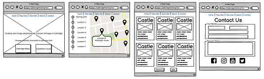
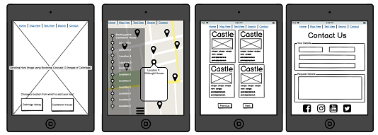
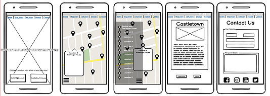

 
# Project Description   
**Code Institute: Interactive Frontend Development**  
 
The Milestone 2 project assignment is to build an interactive front-end site. The site should respond to the users' actions, allowing users to actively engage with data, alter the way the site displays the information to achieve their preferred goals.   
I have the option to choose from one of the following three scenarios or to come up with my own idea:    
. Build a memory game  
. Create a site that calls on the Google Maps API and/or the Google Places API (or similar) to allow users to search for their next holiday destination.  
. Build a front-end website that is themeable and customisable using JavaScript, and that remembers the customisation for the next time.  
  
Project Requirements  
  
Main Technologies  
Required: HTML, CSS, JavaScript.    
Optional: jQuery or any other JavaScript libraries, external APIs.  
    
Mandatory Requirements  
. Dynamic Front End Project: Write custom JavaScript, HTML and CSS code to create a front-end web application consisting of one or more HTML pages with significant interactive functionality.  
. Site Responses: Use JavaScript to have the site produce relevant responses dependent on users' actions.  
. Information Architecture: Incorporate a main navigation menu (unless irrelevant) and structured layout (you might want to use Bootstrap to accomplish this).  
. Documentation: Write a README.md file for your project that explains what the project does and the value that it provides to its users.  
. Version Control: Use Git & GitHub for version control.  
. Attribution: Maintain clear separation between code written by you and code from external sources (e.g. libraries or tutorials). Attribute any code from external sources to its source via comments above the code and (for larger dependencies) in the README.  
. Deployment: Deploy the final version of your code to a hosting platform such as GitHub Pages.  
  
I have chosen to create an interactive site for a Self-Guided Walking Tour of Celbridge, in Co. Kildare.  Again this project is related to one of the voluntary community groups that I'm involved in.  One of the members of the Celbridge Heritage & Tourism Forum produced a printed guide to Celbridge with 30 points of interest.  The Celbridge Heritage & Tourism Forum then sought funding to have an Audio Guide produced based on a slightly altered version on this printed guide.  The site will allow users to choose their starting point and to view the details of the tour via a mobile enable interactive map.    
  
# Content  
 
# UX Design        
   
## User Stories:  
    
The user is looking..... 
 
  - ### First Time Visitor Goals
 
   1. As a First Time Visitor, I want to easily 
   2. As a First Time Visitor, I want to easily 
   3. As a First Time Visitor, I want to be able to navigate the site easily with the minimum number of clicks to get to the desired information.
   4. As a First Time Visitor, I want to 
   5. As a First Time Visitor, I want to 
   6. As a First Time Visitor, I want a site that 
 
   - ### Returning & Frequent Visitor Goals
 
   1. As a Returning Visitor, I want to be able to 
   2. As a Returning Visitor, I want to be able to 
   3. As a Frequent User, I want to be able to   
 
# Functional Specification   
 
## Current feature requirements:      
 *
 *
 *
 *
 *
 *
  
## Future feature requirements:   
*  
*  
*  
 
## Content Requirements:  
*  
*  
*  
 
# Structure  
 
***index.html***  
 
 
# wireframes
[Desktop](https://github.com/StephenJ2020/CI-MS2-Self-Guided-Celbridge/blob/2bcf32e87b2a4d8d0205e465e765f10c6597d36a/assets/images/rm-desktop-wireframe.png)  
     
[Tablet](https://github.com/StephenJ2020/CI-MS2-Self-Guided-Celbridge/blob/2bcf32e87b2a4d8d0205e465e765f10c6597d36a/assets/images/rm-tablet-wireframe.png)  
    
[Mobile](https://github.com/StephenJ2020/CI-MS2-Self-Guided-Celbridge/blob/2bcf32e87b2a4d8d0205e465e765f10c6597d36a/assets/images/rm-mobile-wireframe.png)  
  
   
  
         
# Visual Design  
  
  
    
  
 
# Technologies Used  
 
## Languages Used
 
-  [HTML5](https://en.wikipedia.org/wiki/HTML5)
 
-  [CSS3](https://en.wikipedia.org/wiki/Cascading_Style_Sheets)
 
-  [JavaScript](https://en.wikipedia.org/wiki/JavaScript)
  
  
### Frameworks, Libraries & Programs Used
 
   
# TESTING      
  
    
# Deployment  
 
 
# Credits  
 
 
 
# Acknowledgements  