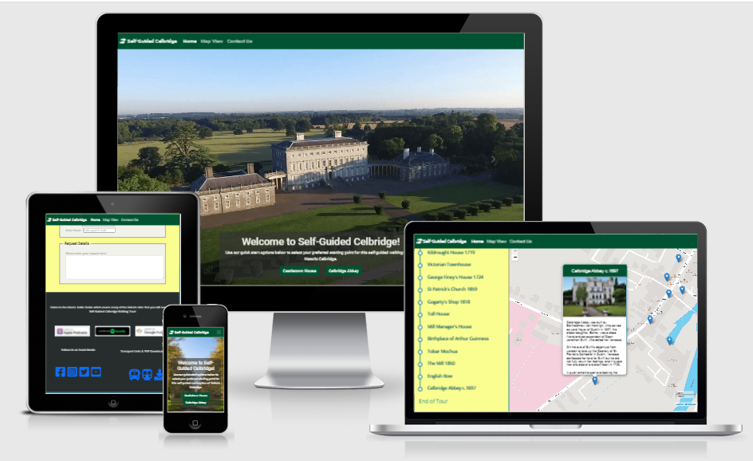
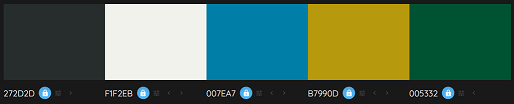

# ***[Self-Guided Celbridge](https://stephenj2020.github.io/CI-MS2-Self-Guided-Celbridge/)***  
   
   
  
# Project Description    
**Code Institute: Interactive Frontend Development**   
  
The Milestone 2 project assignment is to build an interactive front-end site. The site should respond to the users' actions, allowing users to actively engage with data, alter the way the site displays the information to achieve their preferred goals.   
I have the option to choose from one of the following three scenarios or to come up with my own idea:    
  * Build a memory game  
  * Create a site that calls on the Google Maps API and/or the Google Places API (or similar) to allow users to search for their next holiday destination.  
  * Build a front-end website that is themeable and customisable using JavaScript, and that remembers the customisation for the next time.  
    
I have chosen to create an interactive site for a Self-Guided Walking Tour of Celbridge, in Co. Kildare.  Again this project is related to one of the voluntary community groups that I'm involved in.  One of the members of the Celbridge Heritage & Tourism Forum produced a printed guide to Celbridge with 30 points of interest.  The Celbridge Heritage & Tourism Forum then sought funding to have an [Audio Guide](https://www.abartaheritage.ie/castletown-house-and-celbridge-heritage-trail-audio-guide/) produced based on a slightly altered version on this printed guide.  The site will allow users to choose their starting point and to view the details of the tour via a mobile enable interactive map.     
   
#Project Requirements  
  
Main Technologies  
  * Required: HTML, CSS, JavaScript.    
  * Optional: jQuery or any other JavaScript libraries, external APIs.  
    
Mandatory Requirements  
  1. Dynamic Front End Project: Write custom JavaScript, HTML and CSS code to create a front-end web application consisting of one or more HTML pages with significant interactive functionality.  
  2. Site Responses: Use JavaScript to have the site produce relevant responses dependent on users' actions.  
  3. Information Architecture: Incorporate a main navigation menu (unless irrelevant) and structured layout (you might want to use Bootstrap to accomplish this).  
  4. Documentation: Write a README.md file for your project that explains what the project does and the value that it provides to its users.  
  5. Version Control: Use Git & GitHub for version control.  
  6. Attribution: Maintain clear separation between code written by you and code from external sources (e.g. libraries or tutorials). Attribute any code from external sources to its source via comments above the code and (for larger dependencies) in the README.  
  7. Deployment: Deploy the final version of your code to a hosting platform such as GitHub Pages.  
     
    
# Content  
 
# UX Design        
   
## User Stories:  
    
The user is looking a site than can primarily function as a navigation tool for a self-guided walking tour when used on a mobile internet enabled device.  But they also want to be able to use the site as a research and planning tool on their desktop prior to there visit to Celbridge.   
   
  - ### First Time Visitor Goals  
   
 1. As a First Time Visitor, I want to be able to navigate the site easily with the minimum number of clicks to get to the desired information.  
 2. As a First Time Visitor, I want to easily select from which end of the route I want to start the walking tour.  
 3. As a First Time Visitor, I want to easily see an overview of the whole route on a map that is easy to understand.  
 4. As a First Time Visitor, I want to be able to see information about each location without having to leave the map.  
 5. As a First Time Visitor, I want a map that is mobile enabled so that it will show my location if I'm using my mobile or tablet to follow the route.  
 6. As a First Time Visitor, I want a site that gives me the option to view a "text" based version of the details without having to use the map.  
 7. As a First Time Visitor, I want a site that can play the relevant part of the [Abarta Audio Guide](https://www.abartaheritage.ie/castletown-house-and-celbridge-heritage-trail-audio-guide/) at each location on my chosen route.  
 8. As a First Time Visitor, I want a site that allows me to contact the site owner for any additional information I would like about the Self-Guided Walking Tour.  
   
   
   - ### Returning & Frequent Visitor Goals  
   
 1. As a Returning Visitor, I want to be able to revist details of individual locations without having to click through each location in sequence.  
 2. As a Returning Visitor, I want to be able to be able to contact the site owner to arrange a Guided Group Tour.   
 3. As a Frequent User, I want to be able to follow updates on Social Media so that it is quick and easy for me to share them with my family and friends.   
    
# Functional Specification   
 
## Current feature requirements:      
 * Fully responsive website that will automatically adapt for desktop, tablet and mobile devices.    
 * A single page site with four clearly defined sections.  The first section will act as a landing page with each of the other sections hidden from view (using JavaScript) until the user navigates to that section.
 * A navigation bar that will be fixed to the top of the screen so that it is always visible, even as the user scrolls down the page. 
 * A full-screen landing page with a set of three scrolling hero images (using Bootstrap Carousel), each image will visually communicate elements of what the user can expect to encounter upon the self-guided walking tour.  
 * The Home screen / Landing page section will contain two buttons which will allow the user to select their starting point for the self-guided walking tour.    
 * The second section will contain an interactive map showing the full route from the users chosen starting point.  
 * The second section will contain an interactive list of all the locations on the tour.  On Mobile / Tablet devices this will slide out from the left-side of the screen as a secondary navigation function purely for this section of the site and it will be activated by a Hambuger nav button.
 * On Desktop this secondary navigation will permanently occupy one third of the screen.  
 * Each of the locations listed in the secondary navigation will correspond to a marker on the map and will use JavaScript to call a function that will populate the marker with the details about that location.  
 * The third section will use the same JavaScript functions as used in the second section, to create a HTML text based version of the tour details.  On Mobile devices details will be displayed one location at a time.  On Tablets upto four locations will be displayed and on Desktop the details of six locations will be displayed at once.  
 * The third section will use pagination to generate a Next / Previous button to navigate through these text based details.  
 * The fourth and final section will contain a contact form will utilise Email JS to actually send an email request to the site owner.
  
## Future feature requirements:   
* Additional JavaScript functionality will be added that will extract the relevant part of the [Abarta Audio Guide](https://www.abartaheritage.ie/castletown-house-and-celbridge-heritage-trail-audio-guide/) so that the user can chose to play the acompaning audio clip for their current location.  
* Additional JavaScript functionality will be added that will allow the user even greater control of where they start from and the route that they chose to follow.  
  
  
# Structure  
  
***index.html***  
 * Will contain a horizontal fixed navbar.  
 * Will be divided into four clearly defined sections.  
 * Section one will act as a landing page with two buttons to allow the user to choose their starting point for the self-guided walking tour.  
 * Section two will contain an interactive map with a secondary vertical navbar.
 * Section three will generate an HTML text based version of the tour details based on the users chosen starting point.  
 * Section four will contain a contact form and a footer with social media links.
 * Using JavaScript, only one section of the page will be visible at any time.  
      
     
# wireframes
[Desktop](https://github.com/StephenJ2020/CI-MS2-Self-Guided-Celbridge/blob/2bcf32e87b2a4d8d0205e465e765f10c6597d36a/assets/images/rm-desktop-wireframe.png)  
     
[Tablet](https://github.com/StephenJ2020/CI-MS2-Self-Guided-Celbridge/blob/2bcf32e87b2a4d8d0205e465e765f10c6597d36a/assets/images/rm-tablet-wireframe.png)  
    
[Mobile](https://github.com/StephenJ2020/CI-MS2-Self-Guided-Celbridge/blob/2bcf32e87b2a4d8d0205e465e765f10c6597d36a/assets/images/rm-mobile-wireframe.png)  
  
   
  
         
# Visual Design   

With the help of [Colour Mind](http://colormind.io/) I choose the following colour palatte for my site:  


   
A strong but earthy green, clean & crisp white and dark grey, with a medium blue and mustard for a pop of colour.

 * Please note that due to the colour contrast ratio I had to alter the mustard colour to #f9fd72c9 and the blue to #00789f   
 
# Technologies Used  
 
## Languages Used
 
-  [HTML5](https://en.wikipedia.org/wiki/HTML5)
 
-  [CSS3](https://en.wikipedia.org/wiki/Cascading_Style_Sheets)
 
-  [JavaScript](https://en.wikipedia.org/wiki/JavaScript)
  
  
## Frameworks, Libraries & Programs Used

- [jQuery](https://jquery.com/)  
- [Leaflet.js](https://leafletjs.com/)  
- [Font Awesome](https://fontawesome.com/) 
- [Bootstrap 5](https://getbootstrap.com/docs/4.1/getting-started/introduction/) Bootstrap Grid was used for responsiveness as well as features such as Collapse, Carousel & Forms..
- [Balsamiq](https://balsamiq.com) Balsamiq was used to create wireframes during the design process.
- [Google Fonts](https://fonts.google.com) used for project fonts.
- [Gitpod](https://gitpod.io) Gitpod was the IDE used to create the site and for version control.
- [Github](https://github.com/) GitHub is used to store the projects code after being pushed from Gitpod.
- [TinyPNG](https://tinypng.com/) used to compress image sizes.
- Mozilla DevTools used for debugging and testing.
- Google DevTools used for debugging and testing.
- [W3Scool](https://www.w3schools.com/) used as a general source of information.
- [Stackoverflow](https://stackoverflow.com/) used as one of my main sources of information.
- [W3C Markup Validator](https://validator.w3.org/) Used to test HTML code validation.
- [W3C CSS Validatior - Jigsaw](https://jigsaw.w3.org/css-validator/) Used to test CSS code validation.
- [Am I Responsive](http://ami.responsivedesign.is/) used to create Mock-up images to represent the site's responsiveness.
  
    
 
#Development Issues:    
  
This [codepen code](https://codepen.io/kchez/pen/YwedPb) snippet helped me understand which Bootstrap classes I needed to override in order to have the Carousel responsively occupy the full viewport height of the device.
    
Bug fix during Development of Section 4 - Contact Form:  
 * Syntax error, I typed d.none rather than d-none on the second immage that I loaded for display on desktops.
 * I also assigned the class of container to the first div but it should have been container-fluid and this caused section 4 be less than full viewport width.  
 * In my css I gave my class .contact-image-container a width of 100% but this caused a conflict with the container-fluid class resulting in unwanted padding so I removed this width attribute completely.  
 * Plus I needed to add some css to size the contact using ID #contact-form  

 After I merged the mapMarkers branch onto the Master branch I used JShint.com to validate my script.js file and got the following four warnings:  
 * 'const' is available in ES6 (use 'esversion: 6') or Mozilla JS extensions (use moz).  
 * 'let' is available in ES6 (use 'esversion: 6') or Mozilla JS extensions (use moz).  
 * 'arrow function syntax (=>)' is only available in ES6 (use 'esversion: 6').  
 * 'template literal syntax' is only available in ES6 (use 'esversion: 6').  
 After searching on Slack I found a post by Claire lemonnier from the 27Apr 2021 with a similar issue and a response by Stuart Saint advising to add the following two lines to the top of the JS file:   
 * /* jshint esversion: 6 */  
 * /* globals $:false */  
 On further research there were many similar posts and the general consensus was to just include the first line of this: /* jshint esversion: 6 */  
 Having placed this in my script.js file and then re-validating my code in JShint the warnings disappeared.  
  
z-indexing:  
The leaflet js map has a number of layers with a z-index, the highest being the zoom button with a z-index of 1000. 
For my Side Navbar to slide out over the map it needs a z-index higher than the map so I have set it to 1100.
But to deal with the change in the height of the main navbar on different mobile devices I want the side navbar to sit under the main navbar so that there is no gap between the two on certain mobile devices.  
Therefore I have given the main navbar a z-index of 1200 to achieve this.  

Timeline:  
The timeline feature on the side navbar has been tricky to style correctly and I haven't yet styled it for Desktop view.  However I've now noticed that the timeline is appearing on the Map Marker pop-up as I've used the same array and function to populate the Map Markers and the Side Nabvbar.  

Hide / Show Sections:  
I used the following resources to help me understand how to hide / show each section.  
 * [W3C jQuery Selectors](https://www.w3schools.com/jquery/jquery_selectors.asp)  
 * [W3C jQuery Effects - Hide and Show](https://www.w3schools.com/jquery/jquery_hide_show.asp)  
 * [Pretty Printed](https://www.youtube.com/watch?v=WhU38HV-Iu8) youtube tutorial - The jQuery Hide, Show, and Toggle Functions.  
  
Carousel Overlay:  
I have used a code snippet from [Bootsnipp](https://bootsnipp.com/snippets/rv1xd) and I've adapted the code to suit my requirements.  

On-going issue with 'menu' icon for side navbar:  
A post I made on Slack requesting help in the [#interactive-frontend](https://code-institute-room.slack.com/archives/C7HD37Q1F/p1621948997135100) channel.  
[W3C sidenav](https://www.w3schools.com/howto/howto_js_sidenav.asp)  
[W3C toggle class](https://www.w3schools.com/howto/howto_js_toggle_class.asp)  
Channel-Lead video by [Eamonn](https://code-institute-room.slack.com/files/UU5GBNS6M/F01B8T8UETU/ifd_call_23_sep_2010.mp4?origin_team=T0L30B202&origin_channel=D01PGS56LPJ)   
[W3C event ontoggle](https://www.w3schools.com/jsref/event_ontoggle.asp)  
Web Dev Simplified [Event Listeners](https://www.youtube.com/watch?v=XF1_MlZ5l6M)  
Adapted code from [Free Code Camp](https://www.freecodecamp.org/news/javascript-addeventlistener-example-code/)  

Links from Side Navar to Mrker pins:  
Leaflet.js crash course with practical project | Open-source interactive maps 🔥 in Hindi by [Coder's Gyan](https://www.youtube.com/watch?v=LWML4HkOAi0)
Github Repo of [Coder's Gyan](https://github.com/codersgyan/leaflet-store-locator/commit/8887820169d487c705a7cfb4d78d7b1be4df7e09)  
Working project of [Coder's Gyan}(https://codersgyan.github.io/leaflet-store-locator/#)]  
W3C [for-of loop](https://developer.mozilla.org/en-US/docs/Learn/HTML/Howto/Use_data_attributes)   
Stack Overflow [Iterating a loop](https://stackoverflow.com/questions/7364150/find-object-by-id-in-an-array-of-javascript-objects/35398031#35398031)  
MDN [querySelectors](https://developer.mozilla.org/en-US/docs/Web/API/Document/querySelectorAll)  
Stack Overflow [assign ID's to leaflet Map Markers](https://stackoverflow.com/questions/25683871/assign-id-to-marker-in-leaflet)  
Stack Overflow [Link to Leaflet Map Marker](https://stackoverflow.com/questions/14656807/link-to-marker-in-leaflet-map-from-extern-a-tag)  
Github Repo of Turbo87 [Leaflet Sidebar](https://github.com/Turbo87/leaflet-sidebar/blob/master/examples/listing-markers.html)  
Stack Exchange [Leaflet Sidebar](https://gis.stackexchange.com/questions/340698/dynamic-map-sidebar-with-info-from-marker-upon-click)  


# TESTING      
  
 * HTML Validation:  
  
  My html has no error!  
  It does have three warnings:  
  * Warning: Consider avoiding viewport values that prevent users from resizing documents.  
    From line 6, column 1; to line 6, column 107  
    =1.0">-->↩<meta name="viewport" content="width=device-width, initial-scale=1.0, maximum-scale=1.0, user-scalable=no">↩<meta  
  * Warning: Section lacks heading. Consider using h2-h6 elements to add identifying headings to all sections.  
    From line 102, column 5; to line 102, column 30  
    main>↩    <section id="textSection"> <!--  
  * Warning: Section lacks heading. Consider using h2-h6 elements to add identifying headings to all sections.  
    From line 107, column 5; to line 107, column 33  
    tion>↩    <section id="contactSection"> <!--  

The first warning is actual to do with a setting that is reccommended when using [Leaflet.js](https://leafletjs.com/examples/mobile/) on mobile devices so I'm choosing to keep this as it is.    
The second warning is noted but I don't feel there is an appropriate place to add a heading in this section.  
The third warding was noted and I have added a h2 heading.  

 * JShint:
I have no errors and the only warning is that I have an undefined variable L but this is to do with the code used by Leaflet.js so there is nothing I can do about that.  

 * Google Dev Tools Lighthouse Report:  
The report has picked up that I have a large number of images and that the file sizes are very large and that this is affecting the performance slightly.  I have already passed the images through Tinypng.com to compress them.  In future updates I may need to source alternative images for my carousel that can be further compressed.  
[Lighthouse Report Scores](./assets/images/rm-lighthouse.png)   

Bugs

Had an issue were the `locationsReversed` array was updating the oder of options in the side navbar on the map section but the links were not working.  I spent an hour going through the code myself and comparing it to the code used to create the links using my `locations` array for the default starting order and I console.log the array in Dev Tools but i couldn't find the issue.  I then contacted Tutor support and spoke with Miklos who was great, he spent another hour and half stepping through the code with me again and suggesting a few additional console.logs that I could add to help with the troubleshooting and eventually we found that the issue was my second for-of-loop needed to be within the reverseStartLocation() function, which made sense as it only gets called if the user clicks on the `Celbridge Abbey` button on the Landing/Home screen.  
Please see the following screenshots for more detail on this issue and the steps i took to identify and fix it.  
[Screenshot 1](./assets/images/rm-testing-array-locationsReversed-consolelog1.png) - As you can see originally my second for-of-loop was outside of the reverseStartLocation() function.  
[Screenshot 2](./assets/images/rm-testing-array-locationsReversed-consolelog2.png) - This shows that my console log of the `abbeyLinkTo` array on line 438 was empty and this is why my links were not working as they weren't get the locId from class `".reversed-loc-anchor"`.  
[Screenshot 3](./assets/images/rm-testing-array-locationsReversed-consolelog3.png) - This shows that once I moved the second for-of-loop inside the reverseStartLocation() function that it was then getting the `locId`'s via the `abbeyLinkTo` array.  
  
    
## User Story Testing  
  
- ### First Time Visitor Goals
1. The main fixed Navbar has 3 button and the landing page has two quick start button.  In addition a side navbar has been created in the Map section so the user has the option to click the individual marker pins to open the popup or to click the name linked in the side navbar to view the information about each location on the tour.  
2. This can easily be achieved with the two quick start buttons on the landing / homepage.  
3. The Leaflet.js map in initially set to a zoom level of 15 which gives a clear overview of the entire route of the tour.  
4. Each marker pin has a popup which contains all the information about that location.  
5. I had mobile enabled the map but it kept refreshing to you current location and if you want to move the map to see the details of another location before you walk to that location it would jump back to your location within 7 seconds so it was very difficult for the use to navigate with the feature enabled. So I have disabled and removed this and will revisit it for the update of the site.  
6. The Text Version of the site was more complexed than I first thought in terms of generating this from my object array so based on the advice of my Mentor I have removed this and will add it to a future update of the site.   
7. A simple contact form has been provided, although I did not have time to implement Email.js for this current release but it will be enabled for the next release.  
  
- ### Returning & Frequent Visitor Goals  
1. The Side navbar is ideal for selecting a particular location that you want to revist the details of.  
2. Again the Contact form is perfect for this.  
3. Social Media links are contained within the footer at the bottom of the Contact Us section.  


    
# Deployment  

This project was deployed to GitHub Pages following these steps:

1. Login to GitHub  
2. Locate the following GitHub Repository name in the Search Bar: StephenJ2020/CI-MS2-Self-Guided-Celbridge  
3. Click into the repository to view more details
4. Click on Settings, located on the menu tab just below the repository name  
5. On the Menu options on the left select the second last option "Pages"
6. Under Source, select Master in the dropdown menu   
7. Select /(root) in the tab that is next to Branch selector     
8. Click Save and page will automatically refresh
9. You will now see a link to the deployed website   
10. To view the deployed website [click here!](https://stephenj2020.github.io/CI-MS2-Self-Guided-Celbridge/)  

## Forking the GitHub Repository

By forking the GitHub Repository you make a copy of the original repository on your own GitHub account to view and/or make changes without affecting the original repository by following these simple steps:

1. Log in to GitHub and locate the [StephenJ2020/CI-MS2-Self-Guided-Celbridge](https://github.com/StephenJ2020/CI-MS2-Self-Guided-Celbridge)
2. Near the top of the Repository, on the right-hand side of the screen, locate the "Fork" button.
3. Click this button and you should now have a copy of the original repository in your GitHub account.
  
## Making a Local Clone

1. Log in to GitHub and locate the [StephenJ2020/CI-MS2-Self-Guided-Celbridge](https://github.com/StephenJ2020/CI-MS2-Self-Guided-Celbridge)
2. Under the repository name, click "Clone or download" or you may see a button saying "Code" with a download arrow.
3. To clone the repository using HTTPS, under "Clone with HTTPS", copy the link.
4. Open Git Bash
5. Change the current working directory to the location where you want the cloned directory to be made.
6. Type `git clone`, and then paste the URL you copied in Step 3.
```
$ git clone https://github.com/StephenJ2020/CI-MS2-Self-Guided-Celbridge
```
7. Press Enter. Your local clone will be created.
```
$ git clone https://github.com/StephenJ2020/CI-MS2-Self-Guided-Celbridge   
> Cloning into `CI-Clone`...
> remote: Counting objects: 10, done.
> remote: Compressing objects: 100% (8/8), done.
> remove: Total 10 (delta 1), reused 10 (delta 1)
> Unpacking objects: 100% (10/10), done.
``` 
 
 
# Credits  

Favicon: Was created using a [Font Awesome Icon Converter](https://gauger.io/fonticon/) by Paul Ferrett which I found via [Stack Overflow](https://stackoverflow.com/questions/18156240/use-font-awesome-icon-as-favicon)

## Images  
Conolly's Folly is by - [Luke O'Faolain](https://www.google.com/maps/uv?pb=!1s0x48677033a8bfa2ef%3A0xe84c8e5ad72af3ec!3m1!7e115!4s%2Fmaps%2Fplace%2Fconolly%27s%2Bfolly%2F%4053.3698169%2C-6.5604273%2C3a%2C75y%2C139.47h%2C90t%2Fdata%3D*213m4*211e1*213m2*211sEDcDhACe9usFaBTLud5v6A*212e0*214m2*213m1*211s0x48677033a8bfa2ef%3A0xe84c8e5ad72af3ec%3Fsa%3DX!5sconolly%27s%20folly%20-%20Google%20Search!15sCgIgAQ&imagekey=!1e10!2sAF1QipO2TZ7AW4eKJulp-UsGIKzjdAgLgLHC68MBefP3&hl=en&sa=X&ved=2ahUKEwi0373_z8HwAhWiunEKHTWqD8oQpx8wInoECDQQCA)  
Castletown Gate Lodge - [Dream Ireland](https://www.dreamireland.com/site/Round_House_at_Castletown_Celbridge.21589.html)  
Castletown Round House - [Irish Landmark Trust](https://www.irishlandmark.com/property/castletown-round-house/)  
Castletown House & Lake - [Unironedman](https://unironedman.com/2015/10/25/the-inaugural-park-run-at-castletown-house/)  
Mrs Siddons Temple - [Into Kildare](https://intokildare.ie/listings/castletown-house/)  
Batty Langley Lodge - [Irish Landmark Trust](https://www.irishlandmark.com/property/batty-langley-lodge/)  
St. Wolstan's Abbey - [Flickr](https://www.flickr.com/photos/joehoughton/33556874675/)  
Ice-House - [30 Points of Interest - Celbridge](http://www.discovercelbridge.com/wp-content/uploads/2017/02/Discover-Celbridge-Walking-Guide.pdf)  
Victorian House - [Google Maps Street view](https://www.google.ie/maps/place/MAXIMALL+PHONE+SHOP/@53.3385458,-6.539578,3a,75y,283.06h,121.33t/data=!3m6!1e1!3m4!1s8xjZxZ5h2sUtWQNo1SnxiA!2e0!7i16384!8i8192!4m12!1m6!3m5!1s0x486771a9b090abd5:0x2d63deb9e9b4da9c!2sComplete+Leisure+Supplies+Ltd,+Arctic+Spas+Ireland!8m2!3d53.3436111!4d-6.5394444!3m4!1s0x48677181349df4dd:0x33bb8b96a40d8cb1!8m2!3d53.3397646!4d-6.5387911?hl=en&authuser=0)  
George Finey's House - [Google Maps Street view](https://www.google.ie/maps/place/MAXIMALL+PHONE+SHOP/@53.3385458,-6.539578,3a,75y,283.06h,121.33t/data=!3m6!1e1!3m4!1s8xjZxZ5h2sUtWQNo1SnxiA!2e0!7i16384!8i8192!4m12!1m6!3m5!1s0x486771a9b090abd5:0x2d63deb9e9b4da9c!2sComplete+Leisure+Supplies+Ltd,+Arctic+Spas+Ireland!8m2!3d53.3436111!4d-6.5394444!3m4!1s0x48677181349df4dd:0x33bb8b96a40d8cb1!8m2!3d53.3397646!4d-6.5387911?hl=en&authuser=0)  
St. Patrick's Church - [Google Maps Street view](https://www.google.ie/maps/place/MAXIMALL+PHONE+SHOP/@53.3385458,-6.539578,3a,75y,283.06h,121.33t/data=!3m6!1e1!3m4!1s8xjZxZ5h2sUtWQNo1SnxiA!2e0!7i16384!8i8192!4m12!1m6!3m5!1s0x486771a9b090abd5:0x2d63deb9e9b4da9c!2sComplete+Leisure+Supplies+Ltd,+Arctic+Spas+Ireland!8m2!3d53.3436111!4d-6.5394444!3m4!1s0x48677181349df4dd:0x33bb8b96a40d8cb1!8m2!3d53.3397646!4d-6.5387911?hl=en&authuser=0)  
Gogarty's Shop - [Google Maps Street view](https://www.google.ie/maps/place/MAXIMALL+PHONE+SHOP/@53.3385458,-6.539578,3a,75y,283.06h,121.33t/data=!3m6!1e1!3m4!1s8xjZxZ5h2sUtWQNo1SnxiA!2e0!7i16384!8i8192!4m12!1m6!3m5!1s0x486771a9b090abd5:0x2d63deb9e9b4da9c!2sComplete+Leisure+Supplies+Ltd,+Arctic+Spas+Ireland!8m2!3d53.3436111!4d-6.5394444!3m4!1s0x48677181349df4dd:0x33bb8b96a40d8cb1!8m2!3d53.3397646!4d-6.5387911?hl=en&authuser=0)  
The Mill - [Kildare.ie](https://kildare.ie/tourism/typedetails.asp?EventID=22222)  
The rest of the images for the marker pins were sourced from [Discover Celbridge](http://www.discovercelbridge.com/wp-content/uploads/2017/02/Discover-Celbridge-Walking-Guide.pdf) PDF.  
 
 
 
# Acknowledgements 

I would like to thank my Mentor Chris Quinn for his usual good advice and calm manor, he really steered me through this project and kept me focused on the functionality.  
I wish to thank all the team at Code Institute, with a special thanks to Igor, Sheryl, Jo & Miklos in Tutor Support who all helped me with the issues faced in getting the links to the marker pins to work.  
I also wish to thank everyone on the Slack Community for their support and encouragement, again with a special thanks to Goran Kuzma and Babu Patel.